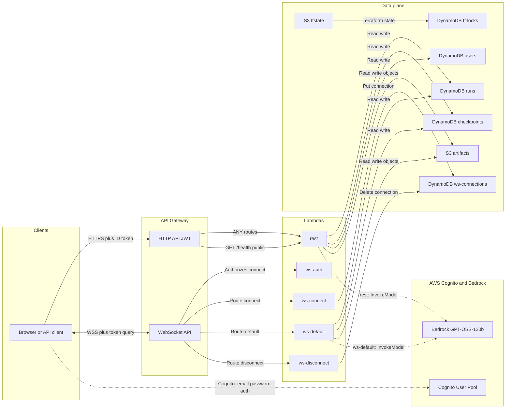

# Agentic Platform — AWS GovCloud Architecture

Region: **`us-gov-west-1`**. Hosting, VPC, RDS, and RAG are **not** deployed.



## Deployed resource names (`project=agentic`, `env=dev`)

| Layer | Resources |
|---|---|
| Auth | `agentic-dev-users`, client `agentic-dev-spa`, group `admins` |
| HTTP | `agentic-dev-http` → `agentic-dev-rest` |
| WebSocket | `agentic-dev-ws` → `ws-auth` / `ws-connect` / `ws-default` / `ws-disconnect` |
| DynamoDB | `runs`, `checkpoints`, `ws-connections`, `users` |
| S3 | `agentic-dev-{account}-artifacts` (not a website) |
| LLM | IAM invoke — agents use `bedrock:openai.gpt-oss-120b-1:0` |
| State | `agentic-tfstate-{account}-us-gov-west-1` + `agentic-terraform-locks` |

## Request paths

1. **Login** — Cognito email/password → ID token  
2. **HTTP** — `Authorization: Bearer <id_token>` → HTTP API JWT authorizer → `rest` Lambda  
3. **WebSocket** — `wss://…/dev?token=<id_token>` → REQUEST authorizer → connect/default/disconnect  
4. **LLM** — `ws-default` / `rest` invoke Bedrock in-region (no RAG)

## Frontend ↔ AWS

```bash
./infra/scripts/deploy.sh
npm run infra:sync-web-env
npm run dev:web
# → http://127.0.0.1:5173/login
```

The Next.js app uses Cognito ID tokens for API Gateway HTTP (`Authorization: Bearer`) and WebSocket (`?token=`). See [`packages/web/lib/auth/`](../packages/web/lib/auth/) and [`app/api-client.ts`](../packages/web/app/api-client.ts).
